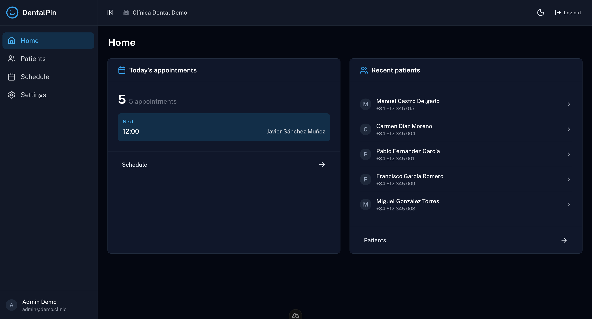
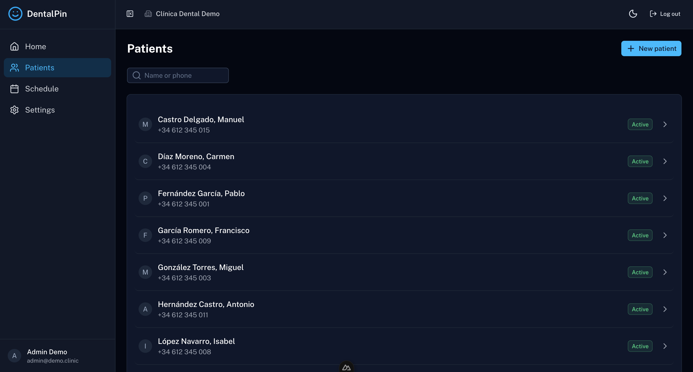
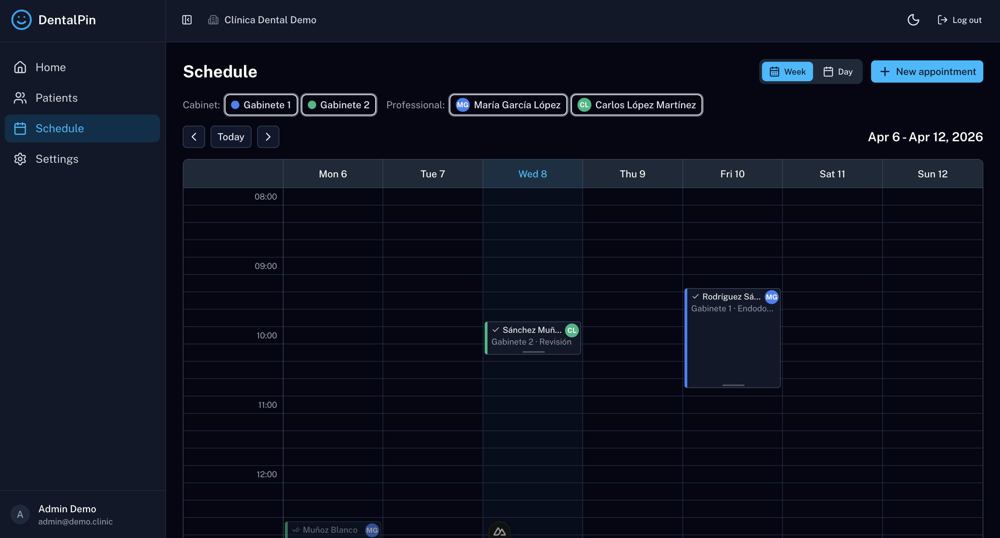
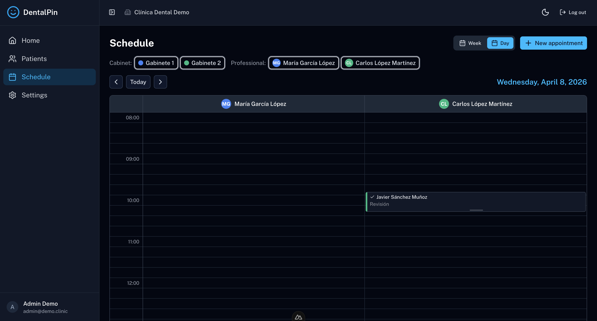
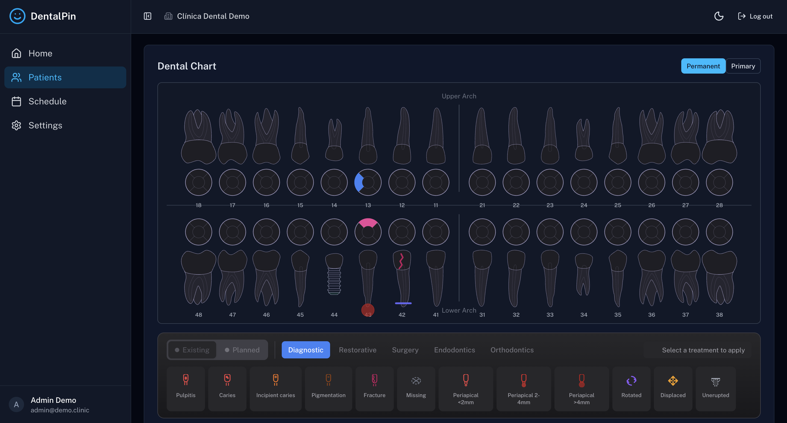
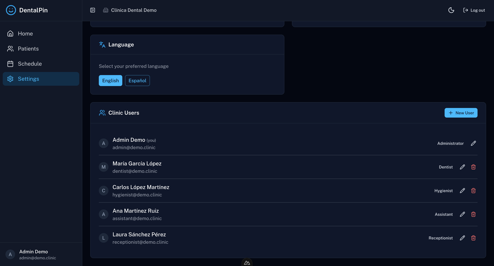

# DentalPin

Open source dental clinic management software. Built with modular architecture for extensibility.

## Why DentalPin?

Dental clinics around the world share the same fundamental needs: managing patients, scheduling appointments, tracking treatments, and running their practice efficiently. Yet the software landscape is fragmented into dozens of localized, closed-source solutions that lock clinics into expensive contracts and outdated technology.

**We believe it's time for a change.**

DentalPin is built on a simple premise: **one open platform for dental clinics everywhere**. Not another regional solution, but a global foundation that any clinic can adopt, any developer can extend, and any community can localize.

### Why now?

AI has fundamentally changed what small teams can build. Features that once required large development departments can now be implemented in days. This is our window to create the open source dental software that should have existed years ago—before clinics got locked into legacy systems they can't escape.

### Our principles

- **Open Source** — Your clinic data belongs to you. Your software should too.
- **Modular** — Start simple, add what you need. Don't pay for features you'll never use.
- **Global by Design** — Built for localization from day one. Same core, any language, any country.
- **API-First** — Every feature is an API. Integrate with anything, automate everything.
- **AI-Ready** — Structured for the AI era. Ready for intelligent scheduling, clinical decision support, and workflow automation.

### The vision

We're not just building software—we're building the foundation for an ecosystem. A platform where developers contribute modules, clinics share improvements, and the entire dental community benefits from collective innovation.

Clinics deserve better than closed, expensive software from the last decade. DentalPin is the open alternative.

## Screenshots

### Dashboard


### Patient Management


### Weekly Schedule


### Daily Schedule


### Dental Chart (Odontogram)


### Settings


## Quick Start

```bash
# Start services
docker-compose up -d

# Seed demo data
./scripts/seed-demo.sh
```

Open http://localhost:3000

### Demo Credentials

All users have password: `demo1234`

| Email | Role | Name |
|-------|------|------|
| admin@demo.clinic | admin | Admin Demo |
| dentist@demo.clinic | dentist | Dra. María García López |
| hygienist@demo.clinic | hygienist | Carlos López Martínez |
| assistant@demo.clinic | assistant | Ana Martínez Ruiz |
| receptionist@demo.clinic | receptionist | Laura Sánchez Pérez |

See [docs/DEMO.md](docs/DEMO.md) for full details on demo data.

## Tech Stack

| Layer | Technology |
|-------|-----------|
| Backend | FastAPI (Python 3.11+) |
| Frontend | Nuxt 3 + Nuxt UI |
| Database | PostgreSQL 15 |
| Auth | JWT with refresh tokens |

## Features (MVP)

- Patient management (create, search, view, edit)
- Appointment calendar (weekly/daily view, drag & drop, conflict detection)
- Multi-role support (admin, dentist, hygienist, assistant, receptionist)
- Spanish localization

## Development

### Prerequisites

- Docker and Docker Compose
- Python 3.11+ (for local backend development)
- Node.js 18+ (for local frontend development)

### Running locally

```bash
# Start all services
docker-compose up

# Or run backend separately
cd backend
pip install -e ".[dev]"
uvicorn app.main:app --reload

# Or run frontend separately
cd frontend
npm install
npm run dev
```

### Database Management

```bash
# Reset database and run migrations
./scripts/reset-db.sh

# Seed demo data (after reset or fresh install)
./scripts/seed-demo.sh

# Full setup (reset + seed in one command)
./scripts/setup-demo.sh
```

### Running tests

```bash
# Backend (in Docker)
docker-compose exec backend python -m pytest -v

# Frontend
cd frontend
npm run test
```

## Architecture

DentalPin uses a modular plugin architecture. Each feature is a self-contained module that:
- Declares its SQLAlchemy models
- Provides a FastAPI router
- Can subscribe to events from other modules

See [docs/architecture.md](docs/architecture.md) for details.

## License

Business Source License 1.1 (BSL 1.1)

**Use Limitation:** You may not offer DentalPin as a commercial SaaS for dental clinic management.

**Change Date:** 4 years from release

**Change License:** Apache 2.0

See [LICENSE](LICENSE) for full terms.

## Contributing

See [CONTRIBUTING.md](CONTRIBUTING.md) for guidelines.

## Backed by

[Dentaltix](https://www.dentaltix.com) - Dental supplies distributor
