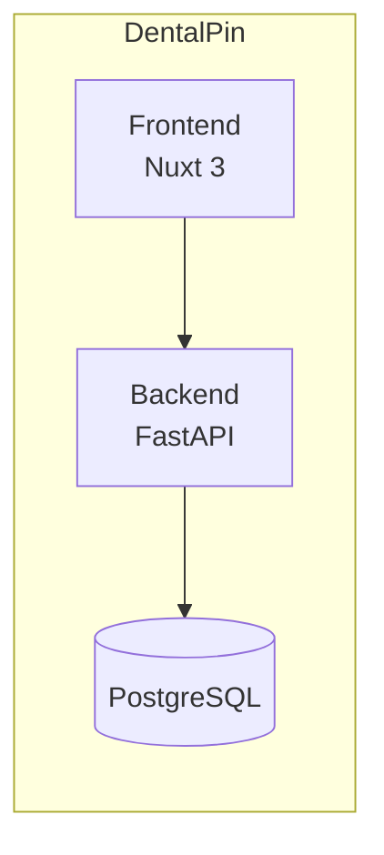

# Architecture Diagrams

Visual documentation for DentalPin system architecture.

All diagrams use [Mermaid.js](https://mermaid.js.org/) and render directly in GitHub.

## Diagrams

| Diagram | Description |
|---------|-------------|
| [System Overview](./system-overview.md) | High-level view of frontend, backend, database, and modules |
| [Module Architecture](./module-architecture.md) | How the plugin/module system works |
| [Data Flow](./data-flow.md) | Request lifecycle from UI to database and back |
| [RBAC Flow](./rbac-flow.md) | How permissions are checked end-to-end |
| [Event Bus](./event-bus.md) | Cross-module communication via events |

## Quick Reference

