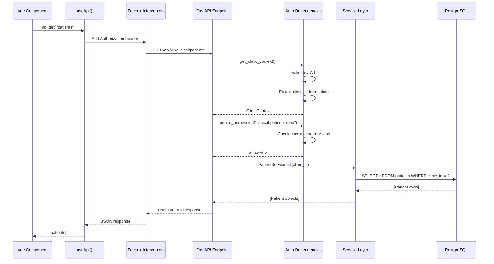
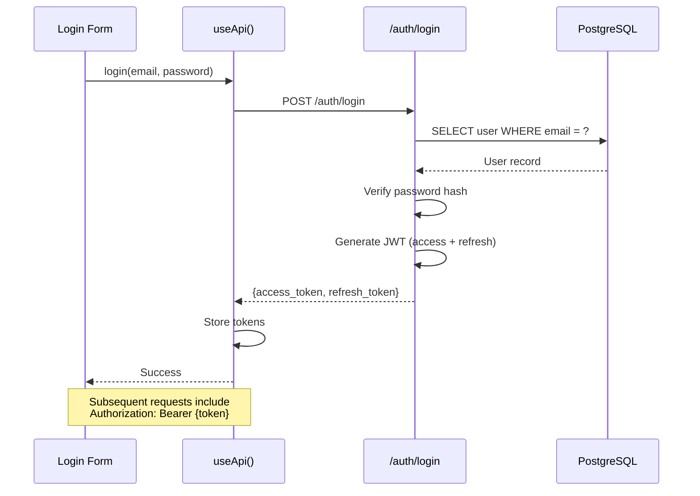
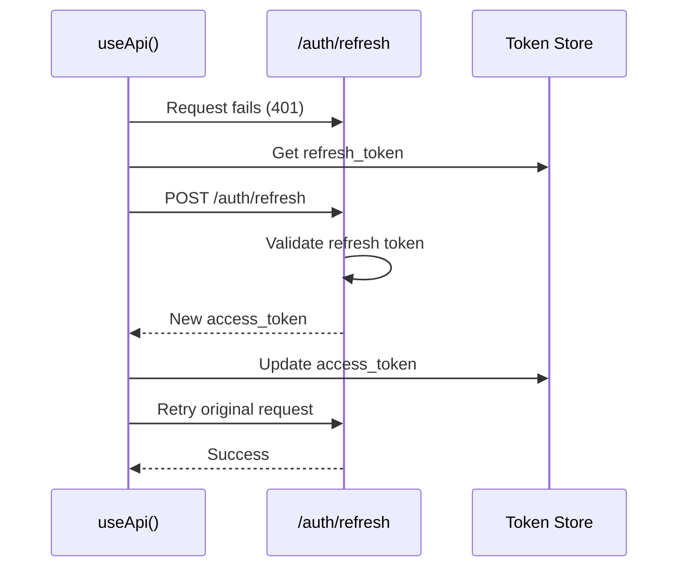
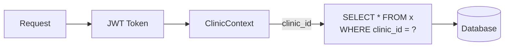

# Data Flow

Request lifecycle from UI to database and back.

## Request Flow

```mermaid
sequenceDiagram
    participant UI as Vue Component
    participant API as useApi()
    participant FE as Fetch + Interceptors
    participant BE as FastAPI Endpoint
    participant Auth as Auth Dependencies
    participant Svc as Service Layer
    participant DB as PostgreSQL

    UI->>API: api.get('/patients')
    API->>FE: Add Authorization header
    FE->>BE: GET /api/v1/clinical/patients

    BE->>Auth: get_clinic_context()
    Auth->>Auth: Validate JWT
    Auth->>Auth: Extract clinic_id from token
    Auth-->>BE: ClinicContext

    BE->>Auth: require_permission("clinical.patients.read")
    Auth->>Auth: Check user role permissions
    Auth-->>BE: Allowed ✓

    BE->>Svc: PatientService.list(clinic_id)
    Svc->>DB: SELECT * FROM patients WHERE clinic_id = ?
    DB-->>Svc: [Patient rows]
    Svc-->>BE: [Patient objects]

    BE-->>FE: PaginatedApiResponse
    FE-->>API: JSON response
    API-->>UI: patients[]
```

## Authentication Flow

```mermaid
sequenceDiagram
    participant UI as Login Form
    participant API as useApi()
    participant BE as /auth/login
    participant DB as PostgreSQL

    UI->>API: login(email, password)
    API->>BE: POST /auth/login
    BE->>DB: SELECT user WHERE email = ?
    DB-->>BE: User record
    BE->>BE: Verify password hash
    BE->>BE: Generate JWT (access + refresh)
    BE-->>API: {access_token, refresh_token}
    API->>API: Store tokens
    API-->>UI: Success

    Note over UI,API: Subsequent requests include<br/>Authorization: Bearer {token}
```

## Token Refresh

```mermaid
sequenceDiagram
    participant API as useApi()
    participant BE as /auth/refresh
    participant Store as Token Store

    API->>BE: Request fails (401)
    API->>Store: Get refresh_token
    API->>BE: POST /auth/refresh
    BE->>BE: Validate refresh token
    BE-->>API: New access_token
    API->>Store: Update access_token
    API->>BE: Retry original request
    BE-->>API: Success
```

## Multi-Tenancy

Every database query filters by `clinic_id`:

```mermaid
graph LR
    REQ[Request] --> JWT[JWT Token]
    JWT --> CTX[ClinicContext]
    CTX --> |clinic_id| QUERY[SELECT * FROM x<br/>WHERE clinic_id = ?]
    QUERY --> DB[(Database)]
```
