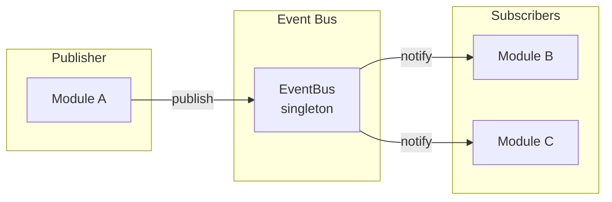
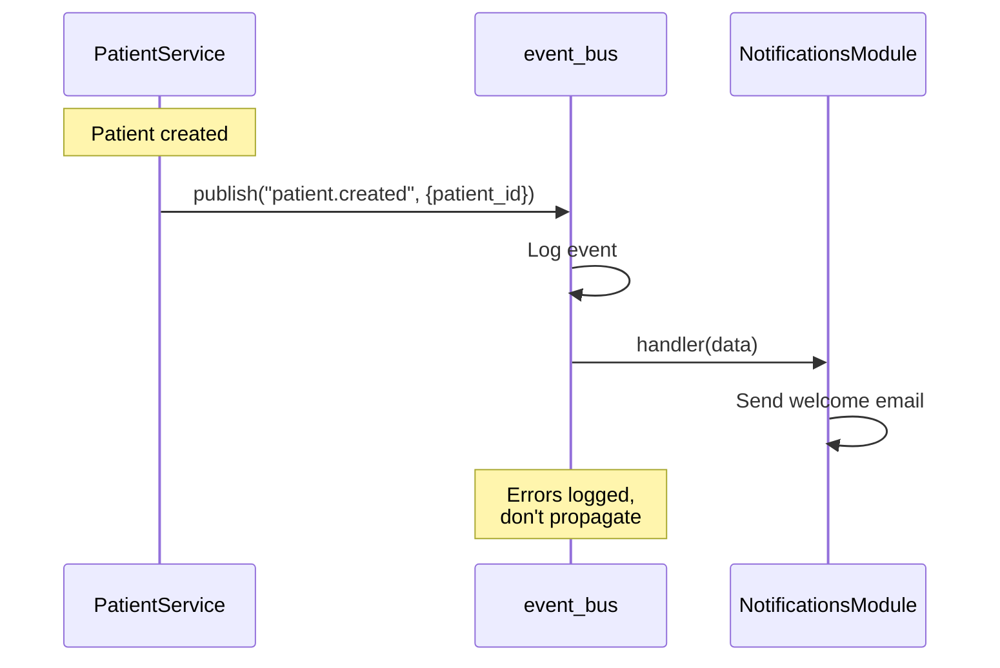
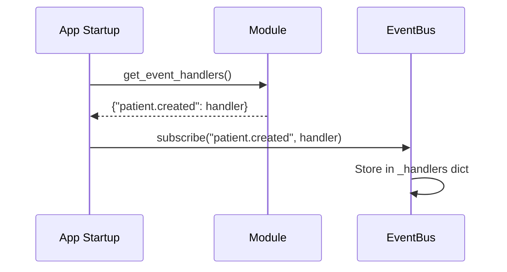
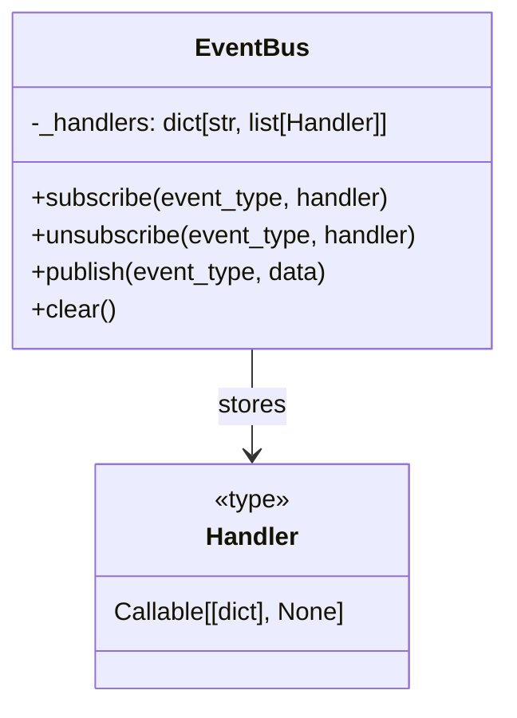

# Event Bus

Cross-module communication via events.

## Overview



## Event Flow



## Subscription Setup



## EventBus Class



## Usage Example

**Publishing an event:**
```python
from app.core.events import event_bus

# In service layer
event_bus.publish("patient.created", {
    "patient_id": str(patient.id),
    "clinic_id": str(patient.clinic_id),
})
```

**Subscribing to events:**
```python
# In module's __init__.py
class NotificationsModule(BaseModule):
    def get_event_handlers(self) -> dict:
        return {
            "patient.created": self._on_patient_created,
            "appointment.scheduled": self._on_appointment_scheduled,
        }

    def _on_patient_created(self, data: dict) -> None:
        # Queue welcome notification
        pass
```

## Event Types

| Event | Data | Triggered By |
|-------|------|--------------|
| `patient.created` | patient_id, clinic_id | PatientService.create |
| `appointment.scheduled` | appointment_id, patient_id | AppointmentService.create |
| `appointment.cancelled` | appointment_id | AppointmentService.cancel |
| `invoice.paid` | invoice_id, amount | BillingService.record_payment |

## Design Notes

- **Synchronous**: Handlers run in same request (MVP)
- **Fire-and-forget**: Errors logged, don't propagate
- **Singleton**: One global `event_bus` instance
- **Testing**: Call `event_bus.clear()` in fixtures
