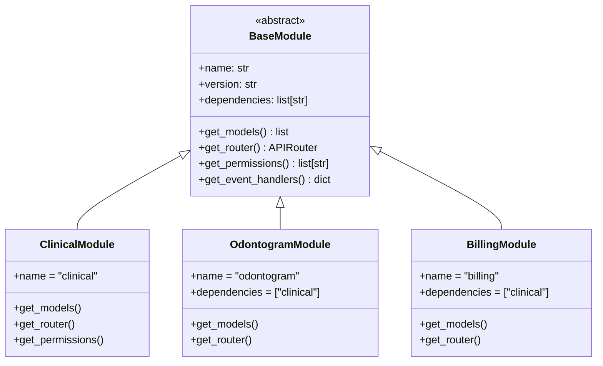
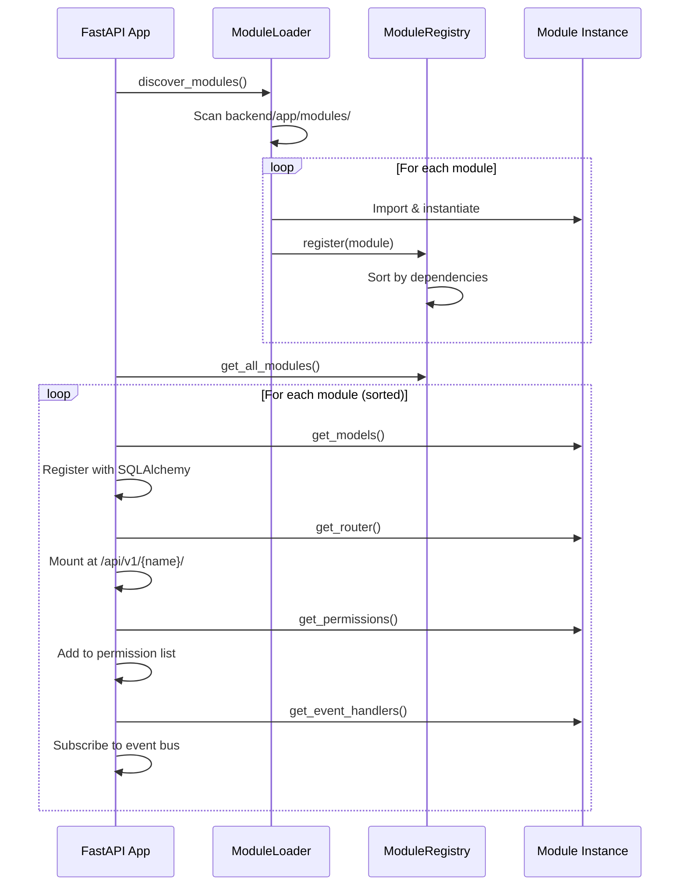

# Module Architecture

How the plugin/module system works.

## Module Structure



## Module Loading



## Module Directory

```
backend/app/modules/{module_name}/
├── __init__.py      # Module class definition
├── models.py        # SQLAlchemy models
├── router.py        # FastAPI endpoints
├── schemas.py       # Pydantic models
└── service.py       # Business logic
```

## Adding a Module

1. Create directory in `backend/app/modules/`
2. Define class extending `BaseModule`
3. Implement required methods
4. Module auto-discovered on startup

See [Creating Modules](../technical/creating-modules.md) for detailed guide.
