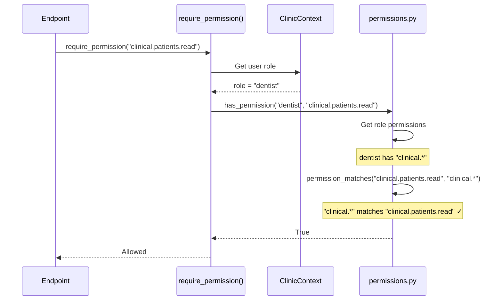
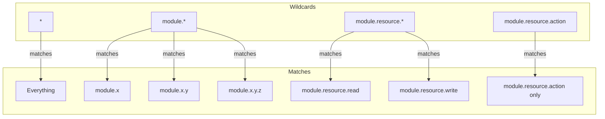
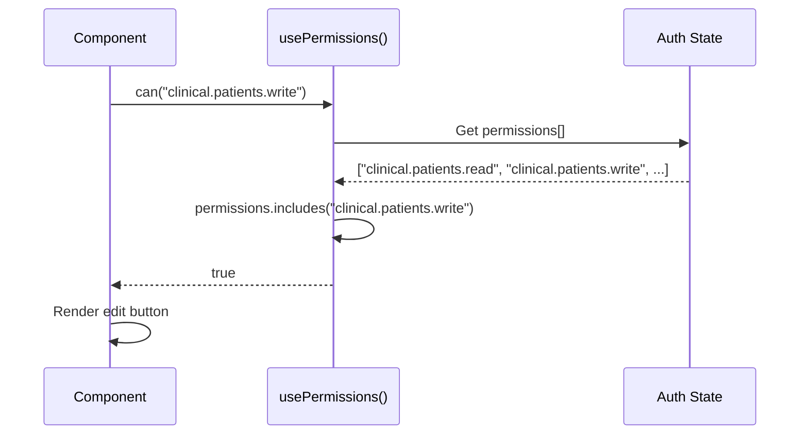

# RBAC Flow

How permissions are checked end-to-end.

## Overview

```mermaid
graph LR
    subgraph "Backend (Source of Truth)"
        ROLES[ROLE_PERMISSIONS<br/>permissions.py]
        EXPAND[expand_permissions()]
    end

    subgraph "API Response"
        ME[/me endpoint]
    end

    subgraph "Frontend"
        PERMS[usePermissions()]
        CAN[can() / canAny()]
        BTN[ActionButton]
        NAV[Navigation]
    end

    ROLES --> EXPAND
    EXPAND --> ME
    ME --> PERMS
    PERMS --> CAN
    CAN --> BTN
    CAN --> NAV
```

## Permission Check Flow



## Wildcard Resolution



## Role Hierarchy

```mermaid
graph TB
    ADMIN[admin<br/>"*"]
    DENTIST[dentist<br/>"clinical.*", "odontogram.*", ...]
    HYGIENIST[hygienist<br/>"clinical.patients.read", ...]
    ASSISTANT[assistant<br/>"clinical.patients.*", ...]
    RECEPTION[receptionist<br/>"clinical.patients.*", ...]

    ADMIN --> |inherits all| DENTIST
    DENTIST --> |more than| HYGIENIST
    DENTIST --> |more than| ASSISTANT
    ASSISTANT --> |similar to| RECEPTION
```

## Frontend Permission Check



## ActionButton Component

```vue
<!-- Only renders if user has permission -->
<ActionButton
  resource="patients"
  action="write"
  @click="edit"
>
  Edit
</ActionButton>
```

```mermaid
graph LR
    PROPS[resource="patients"<br/>action="write"] --> LOOKUP
    LOOKUP[PERMISSIONS.patients.write] --> CHECK
    CHECK["can('clinical.patients.write')"] --> RENDER
    RENDER{has permission?}
    RENDER --> |yes| SHOW[Render button]
    RENDER --> |no| HIDE[Don't render]
```
