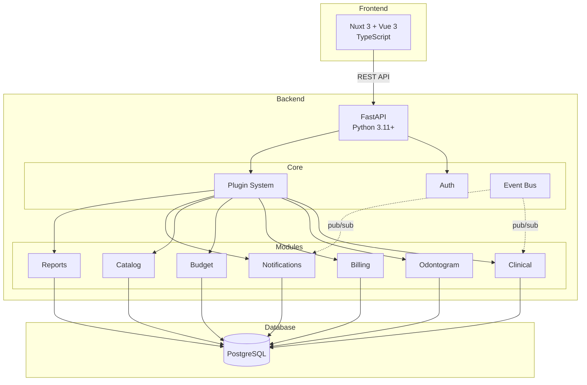

# System Overview

High-level architecture of DentalPin.

## Architecture

## Components

| Layer | Technology | Purpose |
|-------|------------|---------|
| Frontend | Nuxt 3, Vue 3, Nuxt UI | SPA with SSR support |
| API | FastAPI | REST endpoints, JWT auth |
| ORM | SQLAlchemy 2.0 | Async database access |
| Database | PostgreSQL + asyncpg | Multi-tenant data storage |
| Migrations | Alembic | Schema versioning |

## Key Patterns

- **Multi-tenancy**: All data scoped by `clinic_id`
- **Modular**: Features as independent modules
- **Event-driven**: Modules communicate via event bus
- **RBAC**: Role-based permissions with wildcards
